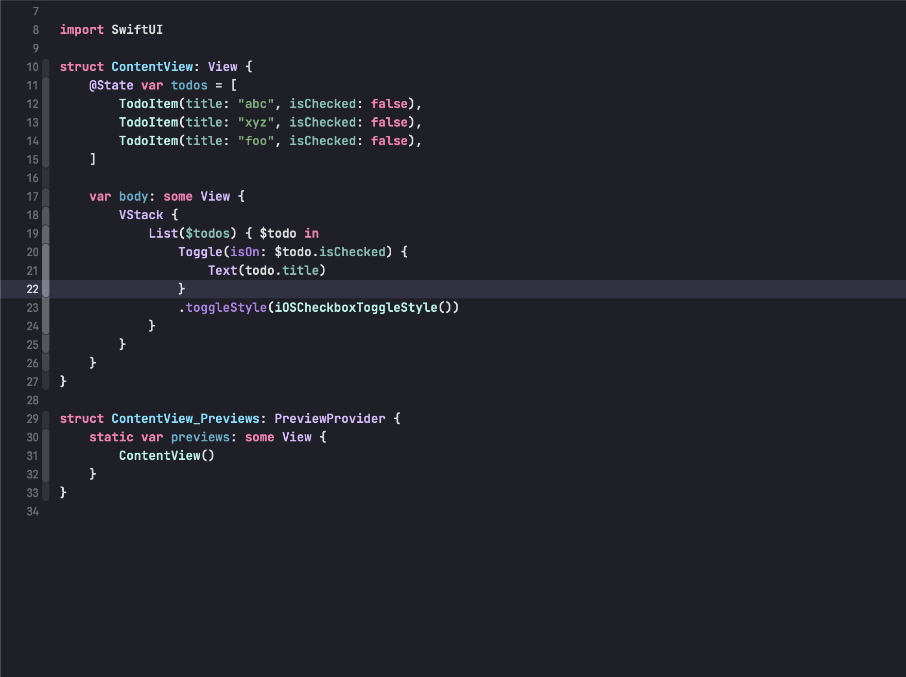

# Xcode Dark Purple Theme
Fork of "Default (Dark)" theme with:

* dark-purple background color
* Modified current line highlight color, text selection color, documentation color, and string color
* Jetbrains Mono font

# Screenshot

